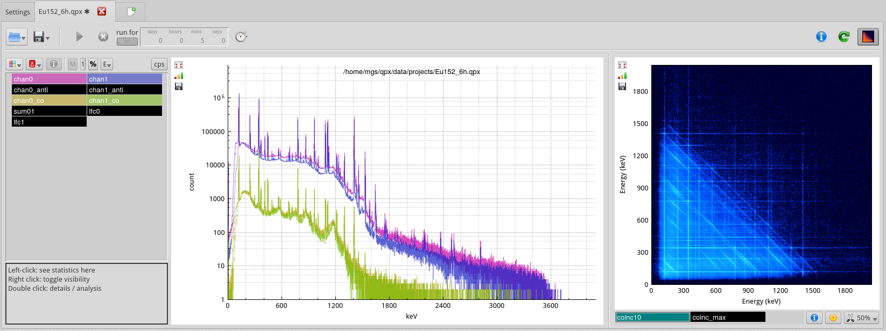

# qpx-gamma

Data acquisition and analysis software for multi-detector gamma spectroscopy.
Developed at NIST. No warranty and no endorsement of specific product. Please read license and disclaimer.

Features:
* simultaneous building of multiple spectra (real-time sorting)
* coincidence matrices with symmetrization, projections, 2D peak search
* list mode output
* loss-free counting spectra
* energy, FWHM and efficiency calibration tools
* basic isotope database
* SUM4 peak integration with uncertainties
* Multiplet deconvolution using Hypermet
* gain matching (iterative online, and post-acquisition)
* automatic digitizer setting optimization to minimize FWHM
* structured experiment automation

Runs on:
* Linux (Ubuntu 18.04 LTS recommended)
* macOS

Supports:
* XIA Pixie-4
* Radiation Technologies HV-8
* Wiener VmUsb
* Iseg VHS-12

Reads:
* Canberra cnf, mca, tka, ava
* Radware spn, spe, mat, m4b
* N42 (ANSI N42.42-2006)
* Gammavision spe
* NSCLdaq evt

Installing / running:
* Start with `git clone https://github.com/usnistgov/qpx-gamma.git`
* `./first_build.sh` will install necessary dependencies, build qpx and 
it will also copy default configuration and sample data files to ~/qpx/
* If using Pixie-4, make sure PLX driver is working (driver and installation script included, see
[src/producers/pixie4/PLX/README](src/producers/pixie4/PLX/README))
* Install script only guaranteed on recent Ubuntu systems. For OSX, you should install the dependencies (boost and Qt) yourself. Examine the Ubuntu scripts for ideas.

This project is no longer being actively maintained. You are welcome to fork it
and develop it further. There is a list of features that we were planning to work on 
[here](https://trello.com/b/YKb96auO/qpx-todo-list).

If you have questions, please contact:
    Martin Shetty (martin.shetty@esss.se)
    Dagistan Sahin (dagistan.sahin@nist.gov)
